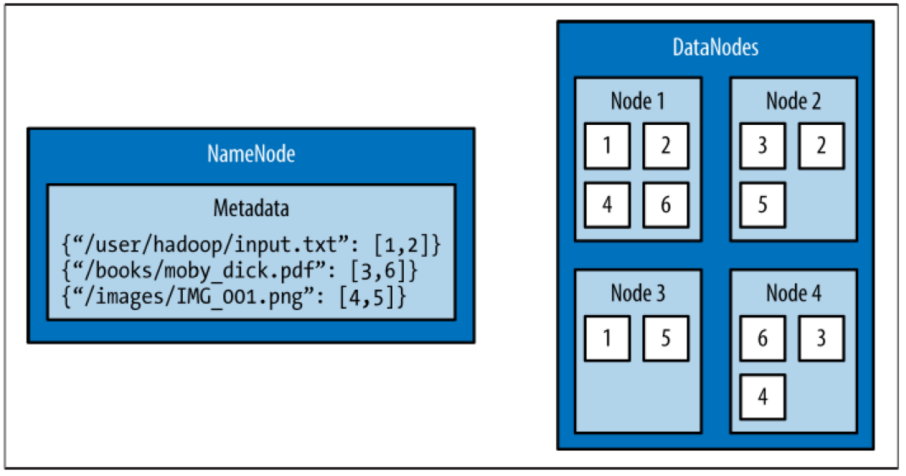

[TOC]

# 源代码

```
git clone https://github.com/MinerKasch/HadoopWithPython
```

Hadoop分布式文件系统（HDFS）是一种基于Java的分布式，可扩展且可移植的文件系统，旨在跨越大型商用服务器集群。 HDFS的设计基于谷歌文件系统GFS，该文件由谷歌发表的论文中描述。 与许多其他分布式文件系统一样，HDFS拥有大量数据，并提供对通过网络分布的许多客户端的透明访问。 HDFS擅长的地方在于它能够以可靠和可扩展的方式存储非常大的文件。

HDFS旨在存储大量信息，通常为PB（非常大的文件），千兆字节和太字节。 这是通过使用块结构文件系统来完成的。 单个文件是分割为固定大小的块，这些块存储在群集中的计算机上。 由几个块组成的文件通常不会在一台机器上存储所有块。

HDFS通过复制块并在群集中分布其中的特定内容来确保可靠性。 默认复制因子为3，表示每个块在群集上存在三次。 即使计算机出现故障，块级重复也可以实现数据可用性。

本章首先介绍HDFS的核心概念，并解释如何使用本机内置命令与文件系统进行交互。在几个例子之后，引入了一个Python客户端库，它允许从Python应用程序中以编程方式访问HDFS。

# (HDFS概述) Overview of HDFS

HDFS的体系结构设计由两个过程组成：名为NameNode的进程保存filesys-tem的元数据，一个或多个DataNode进程存储组成文件的块。NameNode和DataNode进程可以在单个机器上运行，但HDFS集群通常由运行NameNode进程的专用服务器和可能运行DataNode进程的数千台机器组成。

NameNode是HDFS中最重要的机器。它存储整个文件系统的元数据：文件名，文件权限以及每个文件的每个块的位置。为了允许快速访问此信息，NameNode将整个元数据结构存储在内存中。NameNode还跟踪块的复制因子，确保机器故障不会导致数据丢失。由于NameNode是单点故障，因此可以使用辅助NameNode生成主NameNode内存结构的快照，从而降低NameNode失败时数据丢失的风险。

在HDFS中存储块的机器称为DataNodes。DataNode通常是具有大存储容量的商用机器。 与NameNode不同，如果DataNode失败，HDFS将继续正常运行。当DataNode失败时，NameNode将复制丢失的块以确保每个块满足最小复制因子。

图1-1中的示例说明了NameNode中文件到块的映射，以及DataNode中块及其副本的存储。

以下部分介绍如何使用内置命令与HDFS进行交互。


图1-1。 复制因子为2的HDFS集群;NameNode包含文件到块的映射，DataNode存储块及其副本

# (与HDFS交互) Interacting with HDFS

与HDFS的交互主要使用名为hdfs的脚本从命令行执行。 hdfs脚本具有以下用法：

```
$ hdfs COMMAND [-option <arg>]
```

COMMAND参数指示将使用HDFS的哪些功能。-option参数是指定命令的特定选项的名称，<arg>是为此选项指定的一个或多个参数。

## (常见文件操作) Common File Operations

要在HDFS上执行基本文件操作操作，请将dfs命令与hdfs脚本一起使用。 dfs命令支持Linux shell中的许多相同文件操作。

请务必注意，hdfs命令以运行该命令的系统用户的权限运行。 以下示例从名为“hduser”的用户运行。

### (列出目录内容) List Directory Contents

要列出HDFS中目录的内容，请使用-ls命令：

```
$ hdfs dfs -ls
```

在新群集上运行-ls命令不会返回任何结果。这是因为没有任何参数的-ls命令将尝试在HDFS上显示用户主目录的内容。这与主机上的主目录不同（例如，/home/$USER），但它是HDFS中的目录。

提供带正斜杠（/）作为参数的-ls显示HDFS根目录的内容：

```
$ hdfs dfs -ls /
Found 2 items
drwxr-xr-x   - hadoop supergroup    0 2015-09-20 14:36 /hadoop
drwx------   - hadoop supergroup    0 2015-09-20 14:36 /tmp
```

hdfs dfs命令提供的输出类似于Unix文件系统上的输出。 默认情况下，-ls显示文件和文件夹权限，所有者和组。 格式化HDFS时，将自动创建此示例中显示的两个文件夹。 hadoop用户是启动Hadoop守护进程的用户的名称（例如，NameNode和DataNode），并且超级组是HDFS中的超级用户组的名称（例如，hadoop）。

### (创建目录) Creating a Directory

HDFS中的主目录存储在/user/$HOME中。 从上一个带-ls的示例中可以看出，/user目录当前不存在。 要在HDFS中创建/user目录，请使用-mkdir命令：

```
$ hdfs dfs -mkdir /user
```

要为当前用户hduser创建主目录，请再次使用-mkdir命令：

```
$ hdfs dfs -mkdir /user/hduser
```

使用-ls命令验证以前的目录是否已创建：

```
$ hdfs dfs -ls -R /user
drwxr-xr-x    -  hduser  supergroup     0  2015-09-22  18:01  /user/hduser
```

### (将数据复制到HDFS) Copy Data onto HDFS

为当前用户创建目录后，可以使用-put命令将数据上载到用户的HDFS主目录：

```
$ hdfs dfs -put /home/hduser/input.txt /user/hduser
```

此命令将文件/home/hduser/input.txt从本地文件系统复制到HDFS上的/user/hduser/input.txt。

使用-ls命令验证input.txt是否已移至HDFS：

```
$ hdfs dfs -ls 
Found 1 items
-rw-r--r--   1 hduser supergroup         52 2015-09-20 13:20 input.txt
```

### (从HDFS检索数据) Retrieving Data from HDFS

多个命令允许从HDFS检索数据。 要只查看文件的内容，请使用-cat命令。 -cat在HDFS上读取文件并将其内容显示给stdout。 以下命令使用-cat显示/user/hduser/input.txt的内容：

```
$ hdfs dfs -cat input.txt
jack be nimble
jack be quick
jack jumped over the candlestick
```

也可以使用-get命令将数据从HDFS复制到本地文件系统。-get命令与-put命令相反：

```
$ hdfs dfs -get input.txt /home/hduser
```

此命令将HDFS上的/user/hduser中的input.txt复制到本地文件系统上的/home/hduser。

## (HDFS命令参考) HDFS Command Reference

本节中演示的命令是开始使用HDFS所需的基本文件操作。下面是hdfs dfs可能的文件操作命令的完整列表。通过指定不带任何参数的hdfs dfs，也可以从命令行显示此列表。要获取特定选项的帮助，请使用hdfs dfs -usage <option>或hdfs dfs -help <option>。

```
Usage: hadoop fs [generic options]
    [-appendToFile <localsrc> ... <dst>]    
    [-cat [-ignoreCrc] <src> ...]    
    [-checksum <src> ...]    
    [-chgrp [-R] GROUP PATH...]    
    [-chmod [-R] <MODE[,MODE]... | OCTALMODE> PATH...]    
    [-chown [-R] [OWNER][:[GROUP]] PATH...]    
    [-copyFromLocal [-f] [-p] [-l] <localsrc> ... <dst>]
    [-copyToLocal  [-p]  [-ignoreCrc]  [-crc]  <src>  ...<localdst>]    
    [-count [-q] [-h] <path> ...]    
    [-cp [-f] [-p | -p[topax]] <src> ... <dst>]    
    [-createSnapshot <snapshotDir> [<snapshotName>]]
    [-deleteSnapshot <snapshotDir> <snapshotName>]    
    [-df [-h] [<path> ...]]    
    [-du [-s] [-h] <path> ...]    
    [-expunge]    
    [-find <path> ... <expression> ...]    
    [-get [-p] [-ignoreCrc] [-crc] <src> ... <localdst>]
    [-getfacl [-R] <path>]    
    [-getfattr [-R] {-n name | -d} [-e en] <path>]    
    [-getmerge [-nl] <src> <localdst>]    
    [-help [cmd ...]]    
    [-ls [-d] [-h] [-R] [<path> ...]]    
    [-mkdir [-p] <path> ...]    
    [-moveFromLocal <localsrc> ... <dst>]    
    [-moveToLocal <src> <localdst>]    
    [-mv <src> ... <dst>]    
    [-put [-f] [-p] [-l] <localsrc> ... <dst>]    
    [-renameSnapshot <snapshotDir> <oldName> <newName>]    
    [-rm [-f] [-r|-R] [-skipTrash] <src> ...]    
    [-rmdir [--ignore-fail-on-non-empty] <dir> ...]    
    [-setfacl [-R] [{-b|-k} {-m|-x <acl_spec>} <path>]|[--set <acl_spec> <path>]]    
    [-setfattr {-n name [-v value] | -x name} <path>]    
    [-setrep [-R] [-w] <rep> <path> ...]    
    [-stat [format] <path> ...]    
    [-tail [-f] <file>]    
    [-test -[defsz] <path>]   
    [-text [-ignoreCrc] <src> ...]    
    [-touchz <path> ...]    
    [-truncate [-w] <length> <path> ...]    
    [-usage [cmd ...]]   

Generic options supported are
    -conf <configuration file>     specify an application configuration file
    -D <property=value>            use value for given property
    -fs <local|namenode:port>      specify a namenode
    -jt <local|resourcemanager:port>    specify a ResourceManager
    -files <comma separated list of files>    specify comma separated files to be copied to the map reduce cluster
    -libjars <comma separated list of jars>    specify comma separated jar files to include in the classpath.
    -archives <comma separated list of archives>    specify comma separated archives to be unarchived on the compute machines.

The general command line syntax is bin/hadoop command [genericOptions] [commandOptions]
```

下一节将介绍一个允许从Python应用程序中访问HDFS的Python库。

# Snakebite

Snakebite是一个由Spotify创建的Python包，它提供了一个Python客户端库，允许从Python应用程序以编程方式访问HDFS。客户端库使用protobuf消息直接与NameNode通信。Snakebite软件包还包括一个基于客户端库的HDFS命令行界面。

本节介绍如何安装和配置Snakebite软件包。Snakebite的客户端库通过多个示例进行了详细说明，Snakebite的内置CLI是作为hdfs dfs命令的Python替代品引入的。

## (安装) Installation

Snakebite需要Python 2和python-protobuf 2.4.1或更高版本。 目前不支持Python 3。

Snakebite通过PyPI分发，可以使用pip安装：

```
$ pip install snakebite
```

## (客户端库) Client Library

客户端库使用Python编写，使用protobuf消息，并实现Hadoop RPC协议以与NameNode进行通信。 这使Python应用程序可以直接与HDFS通信，而不必对hdfs dfs进行系统调用。

### (列出目录内容) List Directory Contents

例1-1使用Snakebite客户端库列出HDFS中根目录的内容。

**Example 1-1. python/HDFS/list_directory.py**

```
from snakebite.client import Client

client = Client('localhost', 9000)
for x in client.ls(['/']): 
    print x
```

此程序最重要的一行，以及使用客户端库的每个程序，都是创建与HDFS NameNode的客户端连接的行：

```
client = Client('localhost', 9000)
```

Client()方法接受以下参数：

```
host(string)
    NameNode的主机名或IP地址
port(int)
    NameNode的RPC端口
hadoop_version(int)
    要使用的Hadoop协议版本（默认值：9）
use_trash(boolean)
    删除文件时使用垃圾箱
effective_use(string)
    HDFS操作的有效用户（默认值：无或当前用户）
```

主机和端口参数是必需的，它们的值取决于HDFS配置。可以在属性fs.defaultFS下的hadoop/conf/core-site.xml配置文件中找到这些参数的值：

```
<property>   
    <name>fs.defaultFS</name>   
    <value>hdfs://localhost:9000</value>
</property>
```

对于本节中的示例，用于主机和端口的值分别为localhost和9000。

创建客户端连接后，可以访问HDFS文件系统。上一个应用程序的其余部分使用ls命令列出HDFS中根目录的内容：

```
for x in client.ls(['/']):   
    print x
```

值得注意的是Snakebite中的许多方法都会返回生成器。因此必须消耗它们才能执行。 ls方法获取路径列表并返回包含文件信息的映射列表。

执行list_directory.py应用程序会产生以下结果：

```
$ python list_directory.py 
{'group':  u'supergroup',  'permission':  448,  'file_type':  'd', 'access_time':  0L,  'block_replication':  0,  'modifica-tion_time':  1442752574936L,  'length':  0L,  'blocksize':  0L, 'owner': u'hduser', 'path': '/tmp'}
{'group':  u'supergroup',  'permission':  493,  'file_type':  'd', 'access_time':  0L,  'block_replication':  0,  'modifica-tion_time':  1442742056276L,  'length':  0L,  'blocksize':  0L, 'owner': u'hduser', 'path': '/user'}
```

### (创建目录) Create a Directory

使用mkdir() 方法在HDFS上创建目录。 例1-2在HDFS上创建目录/foo/bar和/input。

**Example 1-2. python/HDFS/mkdir.py**

```
from snakebite.client import Client
client = Client('localhost', 9000)
for p in client.mkdir(['/foo/bar', '/input'], create_parent=True):
    print p
```

执行mkdir.py应用程序会产生以下结果：

```
$ python mkdir.py 
{'path': '/foo/bar', 'result': True}
{'path': '/input', 'result': True}
```

mkdir()方法获取路径列表并在HDFS中创建指定的路径。 此示例使用create_parent参数确保创建父目录（如果它们尚不存在）。 将create_parent设置为True类似于mkdir -p Unix命令。

### (删除文件和目录) Deleting Files and Directories

可以使用delete()方法从HDFS中删除文件和目录。 示例1-3以递归方式删除在前一个示例中创建的/foo和/bar目录。

**Example 1-3. python/HDFS/delete.py**

```
from snakebite.client import Client

client = Client('localhost', 9000)
for p in client.delete(['/foo', '/input'], recurse=True):
    print p
```

执行delete.py应用程序会产生以下结果：

```
$ python delete.py 
{'path': '/foo', 'result': True}
{'path': '/input', 'result': True}
```

执行递归删除将删除目录包含的所有子目录和文件。如果找不到指定的路径，则delete方法抛出FileNotFoundException。如果未指定recurse并且存在子目录或文件，则抛出DirectoryException。

recurse参数等效于rm -rf，应谨慎使用。

### (从HDFS检索数据) Retrieving Data from HDFS

与hdfs dfs命令一样，客户端库包含多个允许从HDFS检索数据的方法。要将文件从HDFS复制到本地文件系统，请使用copyToLocal()方法。示例1-4从HDFS复制文件/input/input.txt，并将其放在本地文件系统上的/tmp目录下。

**Example 1-4. python/HDFS/copy_to_local.py**

```
from snakebite.client import Client
client = Client('localhost', 9000)
for f in client.copyToLocal(['/input/input.txt'], '/tmp'):
    print f
```

执行copy_to_local.py应用程序会产生以下结果：

```
$ python copy_to_local.py 
{'path':  '/tmp/input.txt',  'source_path':  '/input/input.txt', 'result': True, 'error': ''}
```

要简单地读取驻留在HDFS上的文件的内容，可以使用text()方法。 例1-5显示了/input/input.txt的内容。

**Example 1-5. python/HDFS/text.py**

```
from snakebite.client import Client
client = Client('localhost', 9000)
for l in client.text(['/input/input.txt']):
    print l
```

执行text.py应用程序会产生以下结果：

```
$ python text.py 
jack be nimble
jack be quick
jack jumped over the candlestick
```

text()方法将自动解压缩并显示gzip和bzip2文件。

## (CLI客户端) CLI Client

Snakebite附带的CLI客户端是基于客户端库的Python命令行HDFS客户端。要执行Snakebite CLI，必须指定NameNode的主机名或IP地址以及NameNode的RPC端口。 虽然有许多方法可以指定这些值，但最简单的方法是创建一个〜.snakebiterc配置文件。示例1-6包含一个示例配置，其NameNode主机名为localhost，RPC端口为9000。

**Example 1-6. ~/.snakebiterc**

```
{    
    "config_version": 2,    
    "skiptrash": true,    
    "namenodes": [        
        {"host": "localhost", "port": 9000, "version": 9},    
    ]
}
```

可以在属性fs.defaultFS下的hadoop/conf/core-site.xml配置文件中找到host和port的值。

有关配置CLI的更多信息，请参阅在线Snakebite CLI文档。

### (用法) Usage

要从命令行使用Snakebite CLI客户端，只需使用命令snakebite。 使用ls选项显示目录的内容：

```
$ snakebite ls /
Found 2 items
drwx------   - hadoop    supergroup    0 2015-09-20 14:36 /tmp
drwxr-xr-x   - hadoop    supergroup    0 2015-09-20 11:40 /user
```

与hdfs dfs命令一样，CLI客户端支持许多熟悉的文件操作命令（例如，ls，mkdir，df，du等）。

snakebite和hdfs dfs的主要区别在于snakebite是一个纯Python客户端，不需要加载任何Java库来与HDFS通信。 这样可以更快地从命令行与HDFS交互。

### (CLI命令参考) CLI Command Reference

以下是使用snakebite CLI客户端可能的文件操作命令的完整列表。通过指定没有任何参数的snakebite，可以从命令行显示此列表。 要查看特定命令的帮助，请使用snakebite [cmd] --help，其中cmd是有效的snakebite命令。

```
snakebite [general options] cmd [arguments]
general options:  
    -D --debug               Show debug information  
    -V --version             Hadoop protocol version (default:9) 
    -h --help                show help  
    -j --json                JSON output  
    -n --namenode            namenode host  
    -p --port                namenode RPC port (default: 8020)  
    -v --ver                 Display snakebite version


commands:  
    cat [paths]                  copy source paths to stdout  
    chgrp <grp> [paths]          change group  
    chmod <mode> [paths]         change file mode (octal)  
    chown <owner:grp> [paths]    change owner  
    copyToLocal [paths] dst      copy paths to local file system destination  
    count [paths]                display stats for paths  
    df                           display fs stats  
    du [paths]                   display disk usage statistics  
    get file dst                 copy files to local file system destination  
    getmerge dir dst             concatenates files in source dir into destination local file  
    ls [paths]                   list a path  
    mkdir [paths]                create directories  
    mkdirp [paths]               create directories and their parents  
    mv [paths] dst               move paths to destination  
    rm [paths]                   remove paths  
    rmdir [dirs]                 delete a directory  
    serverdefaults               show server information  
    setrep <rep> [paths]         set replication factor  
    stat [paths]                 stat information  
    tail path                    display last kilobyte of the file to stdout  
    test path                    test a path  
    text path [paths]            output file in text format  
    touchz [paths]               creates a file of zero length 
    usage <cmd>                  show cmd usage

to see command-specific options use: snakebite [cmd] --help
```

# (章节总结) Chapter Summary

本章介绍并描述了HDFS的核心概念。 它解释了如何使用内置的hdfs dfs命令与文件系统进行交互。 它还介绍了Python库Snakebite。Snakebite的客户端库通过多个示例进行了详细解释。 snakebite CLI也是作为hdfs dfs命令的Python替代品引入的。
