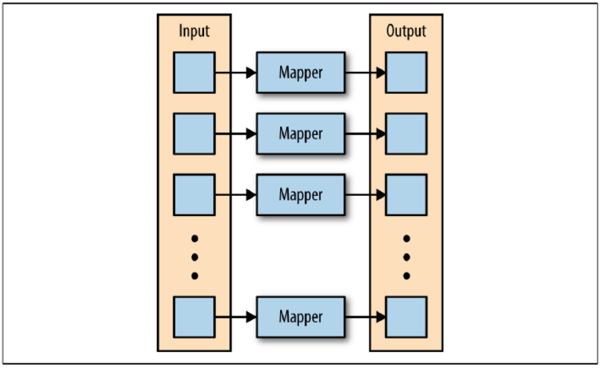
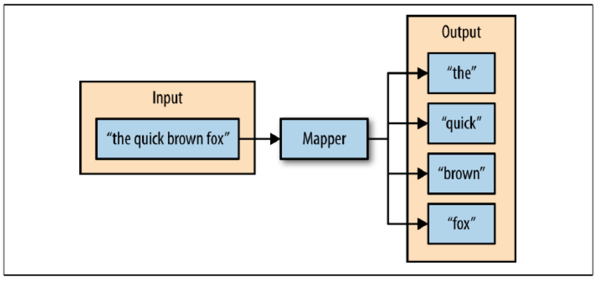
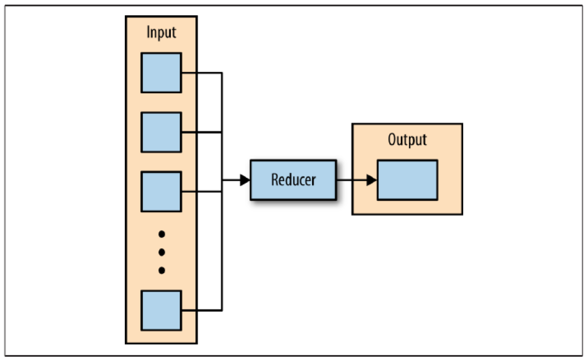
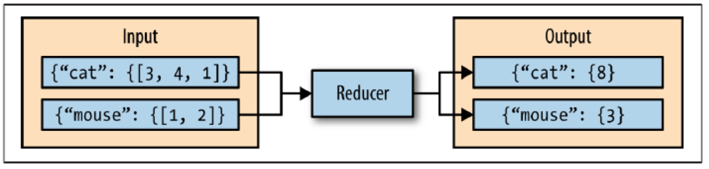

[TOC]

Map Reduce是一种编程模型，它可以通过将工作分成独立的任务并在一组机器上并行执行任务来处理和生成大量数据。 Map Reduce 编程风格的灵感来自函数式编程结构map和reduce，它们通常用于处理数据列表。 在高级别，每个MapReduce程序将输入数据元素列表转换为输出数据元素列表两次，一次在映射阶段，一次在还原阶段。

本章首先介绍MapReduce编程模型，并描述数据如何流经模型的不同阶段。 然后，示例显示了如何使用Python编写MapReduce作业。

# (数据流) Data Flow

MapReduce框架由三个主要阶段组成：map，shuffle和sort，以及reduce。 本节详细介绍了每个阶段。

## Map

Map Reduce应用程序的第一阶段是映射阶段。 在映射阶段，函数（称为映射器）处理一系列键值对。 映射器按顺序依次处理每个键值对，产生零个或多个输出键值对（图2-1）。



图2-1:映射器应用于每个输入键值对，从而生成输出键值对

例如，考虑一个映射器，其目的是将句子转换为单词。 此映射器的输入将是包含句子的字符串，映射器的功能是将句子拆分为单词并输出单词（图2-2）。

图2-2: mapper的输入是一个字符串，mapper的功能是将输入分割为空格; 结果输出是映射器输入中的单个单词

## Shuffle and Sort

MapReduce的第二阶段是随机和排序。 当mappers开始完成时，映射阶段的中间输出将移动到reducer。 将输出从mappers移动到reducers的过程称为混洗。

Shuffling由分区函数处理，称为分区器。 分区器用于控制从mappers到reducers的键值对的流动。 分区器被赋予映射器的输出键和reducer的数量，并返回预期的reducer的索引。 分区程序确保将同一个键的所有值发送到同一个reducer。 默认分区程序是基于哈希的。 它计算映射器输出键的哈希值，并根据此结果分配分区。

reducers开始处理数据之前的最后阶段是排序过程。 在呈现给reducer之前，每个分区的中间键和值都由Hadoop框架排序。

## Reduce

MapReduce的第三阶段是reduce阶段。 在reducer阶段，值的迭代器被提供给称为reducer的函数。 值的迭代器是映射阶段输出中每个唯一键的一组非唯一值。 reducer聚合每个唯一键的值，并产生零个或多个输出键值对（图2-3）。

图2-3:reducer迭代输入值，产生输出键值对

例如，考虑一个reducer，其目的是对键的所有值求和。 此reducer的输入是键的所有值的迭代器，reducer对所有值求和。 然后，reducer输出一个键值对，其中包含输入键和输入键值的总和（图2-4）。


图2-4:reducers总和“cat”和“mouse”键的值

下一节将介绍一个简单的MapReduce应用程序及其在Python中的简化。

# Hadoop Streaming

Hadoop Streaming是一个与Hadoop发行版一起打包的实用程序，它允许使用任何可执行文件创建MapReduce作业作为mapper和/或reducer。 Hadoop流实用程序支持将Python，shell脚本或任何其他语言用作reducer，reducer或两者。

## (它是如何运作的) How It Works

mapper和reducer都是可执行文件，它们从标准输入（stdin）逐行读取输入，并将输出写入标准输出（stdout）。 Hadoop流实用程序创建MapReduce作业，将作业提交到群集，并监视其进度直到完成。

初始化mapper时，每个映射任务都会将指定的可执行文件作为单独的进程启动。 mapper读取输入文件，并通过stdin将每一行显示给可执行文件。 在可执行文件处理每行输入后，mapper从stdout收集输出并将每一行转换为键值对。 键由第一个制表符前面的行部分组成，值由第一个制表符后面的行部分组成。 如果一行不包含制表符，则整行被视为键，值为null。

初始化reducer时，每个reduce任务都会将指定的可执行文件作为单独的进程启动。 reducer将输入键值对转换为通过stdin呈现给可执行文件的行。 reducer从stdout收集可执行文件的结果，并将每一行转换为键值对。 与映射器类似，可执行文件通过制表符分隔键和值来指定键值对。

## (Python示例) A Python Example

为了演示Hadoop流实用程序如何在Hadoop集群上运行Python作为MapReduce应用程序，WordCount应用程序可以实现为两个Python程序：mapper.py和reducer.py。

mapper.py是在WordCount的map阶段实现逻辑的Python程序。 它从stdin读取数据，将行拆分为单词，并将每个单词的中间计数输出到stdout。 例2-1中的代码实现了mapper.py中的逻辑。

**Example 2-1. python/MapReduce/HadoopStreaming/mapper.py**

```
#!/usr/bin/env python

import sys

# Read each line from stdin

for line in sys.stdin:  

    # Get the words in each line  
    words = line.split()  

    # Generate the count for each word  

    for word in words:     
        # Write the key-value pair to stdout to be processed by the reducer.     
        # The key is anything before the first tab character and the      
        #value is anything after the first tab character.     
        print '{0}\t{1}'.format(word, 1)
```

reducer.py是在WordCount的reduce阶段实现逻辑的Python程序。 它从stdin中读取mapper.py的结果，对每个单词的出现次数求和，并将结果写入stdout。 例2-2中的代码实现了reducer.py中的逻辑。

**Example 2-2. python/MapReduce/HadoopStreaming/reducer.py**

```
#!/usr/bin/env python

import sys

curr_word = None
curr_count = 0

# Process each key-value pair from the mapper
for line in sys.stdin:  

    # Get the key and value from the current line  
    word, count = line.split('\t') 

    # Convert the count to an int  
    count = int(count)  

    # If the current word is the same as the previous word,   
    # increment its count, otherwise print the words count   
    # to stdout  
    if word == curr_word:     
        curr_count += count  
    else:     
        # Write word and its number of occurrences as a key-value 
        # pair to stdout     
        if curr_word:
            print '{0}\t{1}'.format(curr_word, curr_count)
        curr_word = word
        curr_count = count

# Output the count for the last word
if curr_word == word:  
    print '{0}\t{1}'.format(curr_word, curr_count)
```

在尝试执行代码之前，请确保mapper.py和reducer.py文件具有执行权限。 以下命令将为两个文件启用此功能：

```
$ chmod a+x mapper.py reducer.py
```

还要确保每个文件的第一行包含Python的正确路径。 此行使mapper.py和reducer.py能够作为独立的可执行文件执行。 值#!/usr/bin/env python应该适用于大多数系统，但如果没有，请将/usr/bin/env python替换为系统上Python可执行文件的路径。

要在将Python程序作为MapReduce作业运行之前在本地测试它们，可以使用echo和sort命令在shell中运行它们。 强烈建议在跨Hadoop集群运行之前在本地测试所有程序。

```
$ echo 'jack be nimble jack be quick' | ./mapper.py | sort -t 1 | ./reducer.py
be      2
jack    2
nimble  1
quick   1
```

一旦mapper和reducer程序成功执行测试，它们就可以使用Hadoop流实用程序作为MapReduce应用程序运行。 在Hadoop集群上运行Python程序mapper.py和reducer.py的命令如下：

```
$ $HADOOP_HOME/bin/hadoop jar   $HADOOP_HOME/mapred/contrib/streaming/hadoop-streaming*.jar \
-files mapper.py,reducer.py \
-mapper mapper.py \
-reducer reducer.py \
-input /user/hduser/input.txt -output /user/hduser/output
```

表2-1列出了Hadoop Streaming实用程序使用的选项。

**Table 2-1. Options for Hadoop streaming**
Option| Description
---|---
-files | A command-separated list of      to be copied to the MapReduce cluster
-mapper | The command to be run as the mapper
-reducer | The command to be run as the reducer
-input | The DFS input path for the Map step
-output | The DFS output directory for the Reduce step

# mrjob

mrjob是一个由Yelp创建的Python Map Reduce库，它包装了Hadoop Streaming，允许MapReduce应用程序以更加Pythonic的方式编写。 mrjob使多步MapReduce作业可以用纯Python编写。 使用mrjob编写的MapReduce作业可以在本地测试，在Hadoop集群上运行，或使用Amazon Elastic MapReduce（EMR）在云中运行。

使用mrjob编写MapReduce应用程序有许多好处：

- mrjob目前是一个非常活跃的框架，每周都有多次提交。
- mrjob拥有广泛的文档，比支持Hadoop上的Python的任何其他框架或库更多。
- 可以在不安装Hadoop的情况下执行和测试mrjob应用程序，从而在部署到Hadoop集群之前实现开发和测试。
- mrjob允许MapReduce应用程序在单个类中编写，而不是为mapper和reducer编写单独的程序。

虽然mrjob是一个很好的解决方案，但它确实有它的缺点。 mrjob是简化的，因此它不会提供与其他API提供的Hadoop相同级别的访问权限。 mrjob不使用typedbytes，因此其他库可能更快。

## (安装) Installation

mrjob的安装很简单; 它可以使用以下命令与pip一起安装：

```
$ pip install mrjob
```

或者它可以从源代码安装（git clone）：

```
$ python setup.py install
```

## WordCount in mrjob

例2-3使用mrjob来实现WordCount算法。
**Example 2-3. python/MapReduce/mrjob/word_count.py**

```
from mrjob.job import MRJob

class MRWordCount(MRJob):   

    def mapper(self, _, line):      
        for word in line.split():         
            yield(word, 1)   

    def reducer(self, word, counts):      
        yield(word, sum(counts))

if __name__ == '__main__':   
    MRWordCount.run()
```

要在本地运行mrjob，唯一需要的是文本体。 要在本地运行作业并计算名为input.txt的文件中的单词频率，请使用以下命令：

```
$ python word_count.py input.txt
```

输出取决于输入文件的内容，但应类似于示例2-4。

**Example 2-4. Output from word_count.py**

```
"be"    2
"jack"    2
"nimble"    1
"quick"    1
```

## What Is Happening

MapReduce作业定义为类MRWordCount。 在mrjob库中，从MRJob继承的类包含定义MapReduce作业步骤的方法。 mrjob应用程序中的步骤是mapper，combiner和reducer。 继承MRJob的类只需要定义其中一个步骤。

mapper()方法定义MapReduce作业的mapper。 它将键和值作为参数并产生元组（output_key，output_value）。 在WordCount示例（示例2-4）中，mapper忽略输入键并拆分输入值以生成单词和计数。

combiner()方法为MapReduce作业定义combiner。 combiner是在mapper之后和reducer之前运行的过程。 它接收mapper发出的所有数据作为输入，并将combiner的输出发送到reducer。 combiner的输入是一个由mapper产生的键和一个值，它是一个生成器，它产生一个与键对应的mapper产生的所有值。 combiner产生（output_key，output_value）元组作为输出。

reducer()方法定义MapReduce作业的reducer。 它需要一个键和值的迭代器作为参数，并产生（output_key，output_value）元组。 在例2-4中，reducer对每个键的值求和，它表示输入中单词的频率。

使用mrjob库编写的MapReduce作业的最后一个组成部分是文件末尾的两行：

```
if __name__ == '__main__':   
    MRWordCount.run()
```

这些行可以执行mrjob; 没有它们，应用程序将无法正常工作。

## Executing mrjob

使用mrjob执行MapReduce应用程序与执行任何其他Python程序类似。 命令行必须包含mrjob应用程序的名称和输入文件：

```
$ python mr_job.py input.txt
```

默认情况下，mrjob将输出写入stdout。

通过在命令行上指定文件名，可以将多个文件作为输入传递给mrjob：

```
$ python mr_job.py input1.txt input2.txt input3.txt
```

mrjob还可以通过stdin处理输入：

```
$ python mr_job.py < input.txt
```

默认情况下，mrjob在本地运行，允许在提交到Hadoop集群之前开发和调试代码。

要更改作业的运行方式，请指定-r/--runner选项。 表2-2包含对运行器选项的有效选择的说明。

**Table 2-2. mrjob runner choices**

| -r inline | (Default) Run in a single Python process                          |
| --------- | ----------------------------------------------------------------- |
| -r local  | Run locally in a few subprocesses simulating some Hadoop features |
| -r hadoop | Run on a Hadoop cluster                                           |
| -r emr    | Run on Amazon Elastic Map Reduce (EMR)                            |

使用runner选项允许mrjob程序在Hadoop集群上运行，输入从HDFS指定：

```
$ python mr_job.py -r hadoop hdfs://input/input.txt
```

mrjob还允许直接从命令行在EMR上运行应用程序：

```
$ python mr_job.py -r emr s3://input-bucket/input.txt
```

## Top Salaries

例2-5使用mrjob计算员工最高年薪和总薪酬。 使用的数据集是2014年巴尔的摩市的工资信息。

**Example 2-5. python/MapReduce/mrjob/top_salary.py**

```
from mrjob.job import MRJob
from mrjob.step import MRStep
import csv

cols  =  'Name,JobTitle,AgencyID,Agency,HireDate,AnnualSalary,GrossPay'.split(',')

class salarymax(MRJob):    
    def mapper(self, _, line):        
        # Convert each line into a dictionary         
        row  =  dict(zip(cols,  [  a.strip()  for  a  in csv.reader([line]).next()]))        

        # Yield the salary
        yield 'salary', (float(row['AnnualSalary'][1:]), line)

        # Yield the gross pay        
        try:            
            yield 'gross', (float(row['GrossPay'][1:]), line)
        except ValueError: 
            self.increment_counter('warn', 'missing gross', 1)


    def reducer(self, key, values):        
        topten = []        

        # For 'salary' and 'gross' compute the top 10        
        for p in values:            
            topten.append(p)            
            topten.sort()            
            topten = topten[-10:]        

        for p in topten:            
            yield key, p    
    combiner = reducer

if __name__ == '__main__':    
    salarymax.run()
```

使用以下命令在Hadoop上执行MapReduce作业：

```
$  python  top_salary.py  -r  hadoop  hdfs:///user/hduser/input/salaries.csv
```

# (章节总结) Chapter Summary

本章介绍了MapReduce编程模型，并描述了数据如何流经模型的不同阶段。 然后使用Hadoop Streaming和mrjob来突出显示如何使用Python编写Map Reduce作业。
