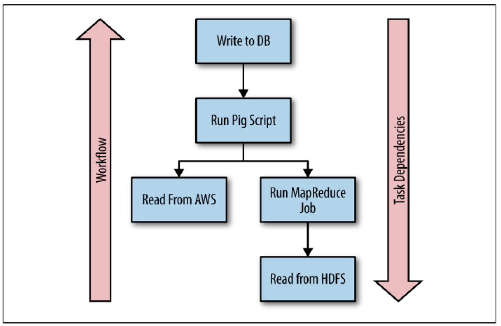

[TOC]

管理Hadoop作业的最流行的工作流程调度程序可以说是Apache Oozie。 与许多其他Hadoop产品一样，Oozie是用Java编写的，是一个基于服务器的Web应用程序，它运行执行Hadoop MapReduce和Pig作业的工作流作业。 Oozie工作流是在XML文档中指定的控制依赖性指导非循环图（DAG）中排列的动作的集合。 虽然Oozie在Hadoop社区中有很多支持，但通过XML属性配置工作流和作业的学习曲线非常陡峭。

Luigi是Spotify创建的Python替代方案，可以构建和配置复杂的批处理作业管道。 它处理依赖项解析，工作流管理，可视化等等。 它还拥有一个庞大的社区，并支持许多Hadoop技术。

本章首先介绍Luigi的安装和工作流程的详细说明。 然后，多个示例显示了Luigi如何用于控制MapReduce和Pig作业。

# Installation

Luigi可以使用pip安装：

```
$ pip install luigi
```

或者它可以从源代码安装：

```
$ git clone https://github.com/spotify/luigi
$ python setup.py install
```

# Workflows

在Luigi中，工作流由一系列动作组成，称为任务。 Luigi任务是非特定的，也就是说，它们可以是任何可以用Python编写的东西。 任务的输入和输出数据的位置称为目标。 目标通常对应于磁盘上，HDFS上或数据库中的文件位置。 除了任务和目标之外，Luigi还利用参数来自定义任务的执行方式。

## Tasks

任务是构成Luigi工作流程的动作序列。 每个任务都声明其依赖于其他任务创建的目标。 这使Luigi能够创建依赖链，以确保在满足所有相关任务和所有这些任务的依赖关系之前不会执行任务。

图5-1描绘了一个突出显示Luigi任务及其依赖关系的工作流程。

图5-1:Luigi任务依赖关系图说明了管道工作和任务之间的依赖关系

## Target

目标是任务的输入和输出。 最常见的目标是磁盘上的文件，HDFS中的文件或数据库中的记录。 Luigi包装了底层文件系统操作，以确保与目标的交互是原子的。 这允许从故障点重放工作流，而不必重放任何已经成功完成的任务。

## Parameters

参数允许通过使值从命令行，以编程方式或从其他任务传递到任务来自定义任务。 例如，任务输出的名称可以通过参数传递给任务的日期来确定。

# An Example Workflow

本节描述了一个工作流，它实现了WordCount算法来解释任务，目标和参数之间的交互。 完整的工作流程如例5-1所示。

**Example 5-1. /python/Luigi/wordcount.py**

```
import luigi

class InputFile(luigi.Task):   
    """   
    A task wrapping a target    
    """   

    input_file = luigi.Parameter()   

    def output(self):      
        """      
        Return the target for this task      
        """      
        return luigi.LocalTarget(self.input_file)

class WordCount(luigi.Task):   
    """   
    A task that counts the number of words in a file   
    """   
    input_file = luigi.Parameter()   
    output_file = luigi.Parameter(default='/tmp/wordcount')   

    def requires(self):      
        """
        The task's dependencies:      
        """      
        return InputFile(self.input_file)   

    def output(self):      
        """      
        The task's output      
        """      
        return luigi.LocalTarget(self.output_file)   

    def run(self):      
        """      
        The task's logic      
        """      
        count = {}      
        ifp = self.input().open('r')      
        for line in ifp:         
            for word in line.strip().split():
                count[word] = count.get(word, 0) + 1      

        ofp = self.output().open('w')      
        for k, v in count.items():
            ofp.write('{}\t{}\n'.format(k, v))      
        ofp.close()

if __name__ == '__main__':   
    luigi.run()
```

此工作流包含两个任务：InputFile和WordCount。 InputFile任务将输入文件返回给WordCount任务。 然后，WordCount任务计算输入文件中每个单词的出现次数，并将结果存储在输出文件中。

在每个任务中，可以重写requires()，output() 和run()方法来自定义任务的行为。

## Task.requires

requires()方法用于指定任务的依赖项。 WordCount任务需要输入InputFile任务：

```
def requires(self):    
    return InputFile(self.input_file)
```

请务必注意，requires（）方法无法返回Target对象。 在此示例中，Target对象包含在InputFile任务中。 使用self.input_file参数调用InputFile任务可以将input_file参数传递给InputFile任务。

## Task.output

output()方法返回一个或多个Target对象。 InputFile任务返回作为WordCount任务输入的Target对象：

```
def output(self):   
    return luigi.LocalTarget(self.input_file)
```

WordCount任务返回作为工作流输出的Target对象：

```
def output(self):   
    return luigi.LocalTarget(self.output_file)
```

## Task.run

run()方法包含任务的代码。 require()方法完成后，执行run()方法。 WordCount任务的run()方法从输入文件中读取数据，计算出现次数，并将结果写入输出文件：

```
def run(self):   
    count = {}   

    ifp = self.input().open('r')   

    for line in ifp:      
        for word in line.strip().split():         
            count[word] = count.get(word, 0) + 1   

    ofp = self.output().open('w')   
    for k, v in count.items():      
        ofp.write('{}\t{}\n'.format(k, v))   
    ofp.close()
```

input()和output()方法是辅助方法，允许任务分别在requires()和output()方法中读取和写入Target对象。

## Parameters

参数使值能够传递到任务，自定义任务的执行。 WordCount任务包含两个参数：input_file和output_file：

```
class WordCount(luigi.Task):   
    input_file = luigi.Parameter()   
    output_file = luigi.Parameter(default='/tmp/wordcount')
```

可以使用默认参数为参数设置默认值。

Luigi为每个Parameter对象创建一个命令行解析器，使值能够在命令行上传递到Luigi脚本，例如--input-file input.txt和--output-file /tmp/output.txt。

## Execution

要从命令行启用执行，应用程序中必须存在以下行：

```
if __name__ == '__main__':   
    luigi.run()
```

这将使Luigi能够从命令行读取命令。

以下命令将执行工作流，从input.txt读取并将结果存储在/tmp/wordcount.txt中：

```
$ python wordcount.py WordCount \
--local-scheduler \
--input-file input.txt \
--output-file /tmp/wordcount.txt
```

# Hadoop  Workflows

本节包含控制Hadoop集群上的MapReduce和Pig作业的工作流。

## Configuration File

本节中的示例需要Luigi配置文件client.cfg来指定Hadoop流式传输jar的位置以及Pig主目录的路径。 配置文件应该在当前工作目录中，配置文件的示例如例5-2所示。

**Example 5-2. python/Luigi/client.cfg**

```
[hadoop]
streaming-jar: /usr/lib/hadoop-xyz/hadoop-streaming-xyz-123.jar

[pig]
home: /usr/lib/pig
```

## MapReduce in Luigi

Luigi脚本可以使用Hadoop流控制Hadoop集群上MapReduce作业的执行（例5-3）。

**Example 5-3. python/Luigi/luigi_mapreduce.py**

```
import luigi
import luigi.contrib.hadoop
import luigi.contrib.hdfs

class InputFile(luigi.ExternalTask):   
    """   
    A task wrapping the HDFS target   
    """   
    input_file = luigi.Parameter()   

    def output(self):      
        """      
        Return the target on HDFS      
        """      
        return luigi.contrib.hdfs.HdfsTarget(self.input_file)

class WordCount(luigi.contrib.hadoop.JobTask):   
    """   
    A task that uses Hadoop streaming to perform WordCount   
    """   
    input_file = luigi.Parameter()   
    output_file = luigi.Parameter()   

    # Set the number of reduce tasks   
    n_reduce_tasks = 1   

    def requires(self):      
        """      
        Read from the output of the InputFile task      
        """      
        return InputFile(self.input_file)

    def output(self):      
        """      
        Write the output to HDFS      
        """      
        return luigi.contrib.hdfs.HdfsTarget(self.output_file)  

    def mapper(self, line):      
        """      
        Read each line and produce a word and 1     
        """      
        for word in line.strip().split():         
            yield word, 1   

    def reducer(self, key, values):      
        """      
        Read each word and produce the word and the sum of       its values      
        """      
        yield key, sum(values)

if __name__ == '__main__':   
    luigi.run(main_task_cls=WordCount)
```

Luigi打包支持Hadoop流媒体。 实现MapReduce作业的任务必须是luigi.contrib.hadoop.JobTask的子类。 可以重写mapper()和reducer()方法来实现MapReduce作业的map和reduce方法。

以下命令将执行工作流，从/user/hduser/input.txt读取并将结果存储在HDFS上的/user/hduser/wordcount中：

```
$ python luigi_mapreduce.py --local-scheduler \
--input-file /user/hduser/input/input.txt \
--output-file /user/hduser/wordcount
```

## Pig in Luigi

Luigi可用于控制Hadoop集群上Pig的执行（例5-4）。

**Example 5-4. python/Luigi/luigi_pig.py**

```
import luigi
import luigi.contrib.pig
import luigi.contrib.hdfs

class InputFile(luigi.ExternalTask):   
    """   
    A task wrapping the HDFS target   
    """   
    input_file = luigi.Parameter()   

    def output(self):      
        return luigi.contrib.hdfs.HdfsTarget(self.input_file)

class WordCount(luigi.contrib.pig.PigJobTask):   
    """   
    A task that uses Pig to perform WordCount   
    """   
    input_file = luigi.Parameter()   
    output_file = luigi.Parameter()   
    script_path = luigi.Parameter(default='pig/wordcount.pig')

    def requires(self):      
        """      
        Read from the output of the InputFile task      
        """      
        return InputFile(self.input_file)   

    def output(self):      
        """      
        Write the output to HDFS      
        """      
        return luigi.contrib.hdfs.HdfsTarget(self.output_file)        
        def pig_parameters(self):      
            """      
            A dictionary of parameters to pass to pig      
            """      
            return {'INPUT': self.input_file, 'OUTPUT': self.output_file}   

        def pig_options(self):      
            """      
            A list of options to pass to pig      
            """      
            return ['-x', 'mapreduce']   

        def pig_script_path(self):      
            """      
            The path to the pig script to run      
            """      
            return self.script_path

if __name__ == '__main__':   
    luigi.run(main_task_cls=WordCount)
```

Luigi打包支持Pig。 实现Pig作业的任务必须是luigi.contrib.hadoop.PigJobTask的子类。 pig_script_path()方法用于定义要运行的Pig脚本的路径。 pig_options()方法用于定义传递给Pig脚本的选项。 pig_parameters()方法用于将参数传递给Pig脚本。

以下命令将执行工作流，从/user/hduser/input.txt读取并将结果存储在HDFS上的/user/hduser/output中。 --script-path参数用于定义要执行的Pig脚本：

```
$ python luigi_pig.py --local-scheduler \
--input-file /user/hduser/input/input.txt \
--output-file /user/hduser/output \
--script-path pig/wordcount.pig
```

# (章节总结) Chapter Summary

本章介绍了Luigi作为Python工作流程调度程序。 它描述了Luigi工作流的组件，并包含使用Luigi来控制MapReduce作业和Pig脚本的示例。
